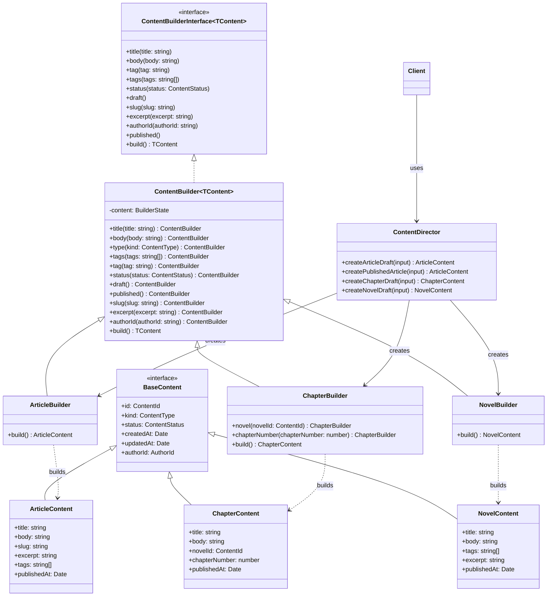

# Builder Pattern Guide

Back to the main project guide: [README](../README.md)

## Overview

This document explains the Builder pattern example used in this repository.

The goal of this example is educational: show a clear Builder-pattern structure in TypeScript while still keeping three concrete CMS content types.

The example uses:

- one shared base builder for common construction steps
- one builder interface for the fluent contract
- three concrete builders for three concrete products
- one director that demonstrates predefined construction flows

## Why Builder fits this example

These content types are good Builder candidates because:

- some fields are required
- some fields are optional
- the object is easier to understand when built step by step
- validation should happen in one place before returning the final object

## Files involved

- `src/index.ts` runs the example.
- `src/content/BaseContent.ts` defines shared content fields and core types.
- `src/content/ContentBuilderInterface.ts` defines the builder interface used by the director.
- `src/content/ContentBuilder.ts` contains the builder implementation.
- `src/content/TypedContentBuilders.ts` provides dedicated builders for articles, chapters, and novels.
- `src/content/ContentDirector.ts` creates predefined drafts with fixed build steps.
- `src/content/article/ArticleContent.ts` defines the article product.
- `src/content/chapter/ChapterContent.ts` defines the chapter product.
- `src/content/novel/NovelContent.ts` defines the novel product.

## UML class diagram



This UML view is intentionally pattern-first: one director, one builder contract, one shared base builder, and three concrete builders that produce three concrete content types.

## Content model

The example keeps three concrete product types:

- `ArticleContent`
- `ChapterContent`
- `NovelContent`

All of them share `BaseContent` fields:

- `id`
- `kind`
- `status`
- `createdAt`
- `updatedAt`
- `authorId`

Then each product adds its own fields.

For example:

- `ArticleContent` adds `slug`, `excerpt`, and `tags`
- `ChapterContent` adds `novelId` and `chapterNumber`
- `NovelContent` adds `excerpt` and `tags`

## Builder methods

The fluent API currently supports:

- `title()`
- `body()`
- `tags()`
- `tag()`
- `status()`
- `draft()`
- `slug()`
- `excerpt()`
- `authorId()`
- `published()`
- `build()`

The base builder also provides protected helpers used by concrete builders for shared validation and content-kind assignment.

## Better validation messages

The builders report exactly which required values are still missing.

Example:

```ts
new ContentBuilder().build();
// Error: Missing required fields: title, body, authorId
```

This is more useful than a generic error because it tells you what still needs to be set.

## Separate builders for each content type

Instead of using one builder for every content shape, the project now has dedicated builders:

- `ArticleBuilder`
- `ChapterBuilder`
- `NovelBuilder`

These builders reuse the shared logic from `ContentBuilder`, set the content kind up front, and add any type-specific requirements they need.

Example:

```ts
const article = new ArticleBuilder()
  .title("Builder Pattern")
  .body("Step-by-step construction")
  .authorId("author123")
  .slug("builder-pattern")
  .excerpt("A short summary of the article")
  .build();
```

## Director class for predefined drafts

`ContentDirector` keeps the client-facing API simple.

For learning purposes, it shows how a director can hide construction details and provide predefined creation flows on top of the builders.

Its public methods are:

- `createArticleDraft(...)`
- `createPublishedArticle(...)`
- `createChapterDraft(...)`
- `createNovelDraft(...)`

Example:

```ts
const director = new ContentDirector();

const chapterDraft = director.createChapterDraft({
  title: "Chapter 1",
  body: "A predefined draft built by the director.",
  authorId: "author123",
  novelId: "novel-001",
  chapterNumber: 1,
});
```

## Default values

When the builder starts, it provides:

- `tags: []`
- `status: "draft"`
- `createdAt: new Date()`
- `updatedAt: new Date()`

## Status invariants

The builder now keeps publishing state consistent:

- `published` always implies `publishedAt`
- `draft` always removes `publishedAt`

That means calling `status("published")` or `published()` guarantees a publish timestamp, and calling `status("draft")` or `draft()` guarantees there is no publish timestamp left on the object.

## Required fields before build

Common fields required before `build()` returns a valid product:

- `title`
- `body`
- `authorId`

Concrete builders may add more required fields:

- `ArticleBuilder`: `slug`, `excerpt`
- `ChapterBuilder`: `novelId`, `chapterNumber`
- `NovelBuilder`: `excerpt`

If required fields are missing, the builder throws a descriptive error.

## Example usage

```ts
const content = new ArticleBuilder()
  .title("My First Article")
  .body("This is the body of my first article.")
  .tags(["typescript", "design patterns"])
  .authorId("author123")
  .slug("my-first-article")
  .excerpt("A first article for the builder demo")
  .published()
  .build();
```

## Current state

This builder example now includes:

- a shared `BaseContent` model
- three concrete product types: article, chapter, and novel
- a generic base builder for shared construction behavior
- dedicated concrete builders for each content type
- a director that demonstrates predefined creation flows
- clearer validation errors and publishing invariants

- clearer validation errors
- a builder interface between the director and concrete builders
- separate builders for each content type
- a director class for predefined draft flows
